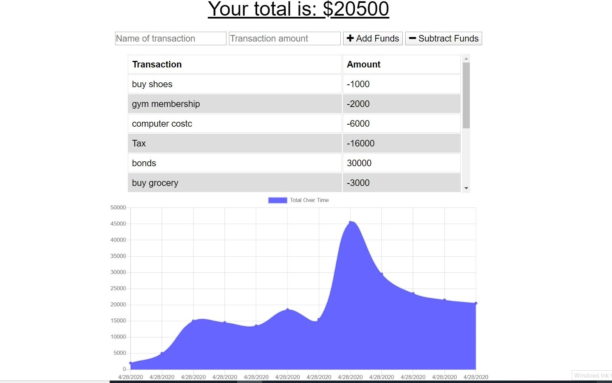

# Budget-tracker #

### The feature for this app is: ###

This app allows user to continue add funds, subtract funds and track budget when offline. The app will automatically update all the budget done when offline and integrate with the whole system when reload. 

#### User should be able to: ####

* App can be taken offline
* Deposits and withdrawals can be made offline
* When back online the deposits and withdrawals update the database

### Requirements: ###
__Web manifest file Service worker js NPM Mongoose NPm Express__

**Screenshots to give you better idea how this app works.**

